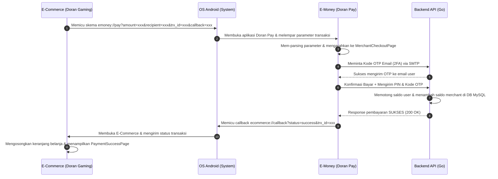
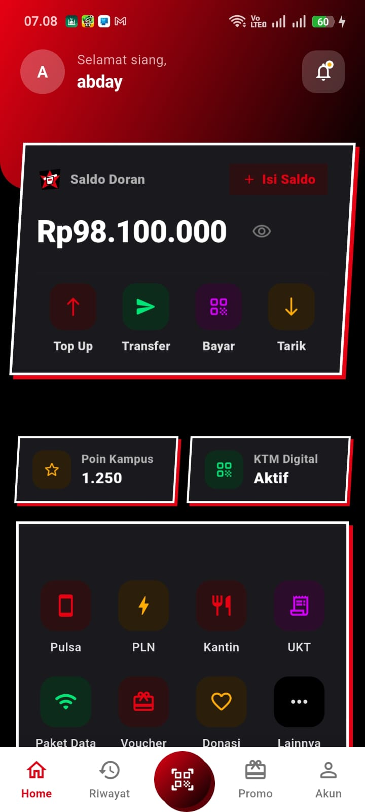
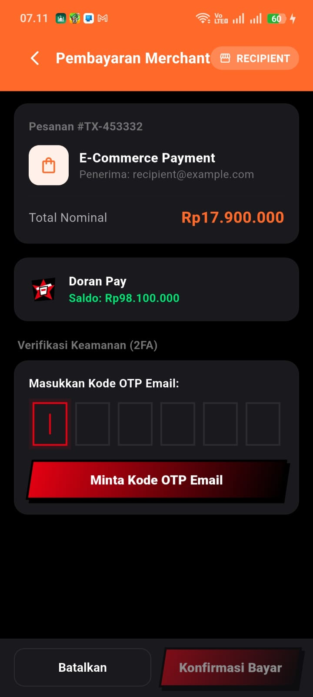
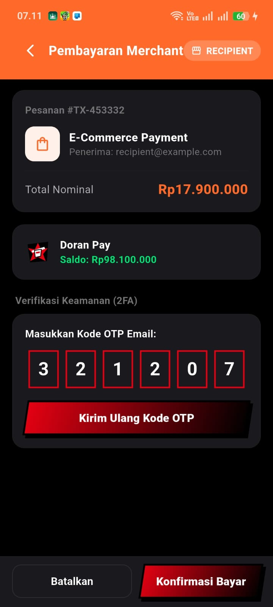

# Doran Pay - Aplikasi E-Wallet dan Payment Gateway

Proyek ini adalah bagian dari tugas Ujian Akhir Semester (UAS) Genap 2025/2026 untuk mata kuliah Aplikasi Mobile Lanjutan.

### Identitas Mahasiswa

| Detail Akademik | Informasi |
| :--- | :--- |
| **Nama Lengkap** | Muhammad Abday Abdul Hafidz |
| **NIM** | 1123150093 |
| **Kelas** | TI SE23 P1 |
| **Program Studi** | Teknik Informatika |
| **Mata Kuliah** | Aplikasi Mobile Lanjutan (KB1154) |
| **Dosen Pengampu** | IKetut Gunawan, S.KOM, M.T.I |
| **Institut** | Institut Teknologi dan Bisnis Bina Sarana Global |

---

## 1. Deskripsi Aplikasi
Doran Pay adalah aplikasi dompet digital (E-Wallet) dan payment gateway mandiri yang dibangun menggunakan Flutter. Aplikasi ini berfungsi sebagai penyedia layanan pembayaran digital (wallet) yang diintegrasikan langsung secara App-to-App dengan aplikasi e-commerce Doran Gaming Console melalui mekanisme Deep Link.

### Fitur Utama:
* **Manajemen Saldo**: Menampilkan informasi saldo akun pengguna secara real-time.
* **Otentikasi dan Registrasi**: Pendaftaran akun baru dengan verifikasi keamanan awal.
* **Integrasi Pembayaran (Deep Link)**: Menerima permintaan checkout belanja dari aplikasi E-Commerce, memproses pembayaran, memotong saldo, dan mengembalikan status transaksi sukses/gagal ke aplikasi E-Commerce.
* **Two-Factor Authentication (2FA)**: Pengamanan transaksi digital menggunakan verifikasi 2 langkah (Email OTP, Google Authenticator TOTP, dan Push Notification).
* **Riwayat Transaksi**: Mencatat semua detail pengeluaran (debit) dan pemasukan saldo (credit).
* **Desain Estetika Premium (Persona 5 Royal)**: Antarmuka bertema gelap (dark theme) dengan kombinasi warna hitam pekat, abu-abu gelap, dan merah menyala, dilengkapi dengan aksen visual yang memanjakan mata.

---

## 2. Arsitektur Aplikasi
Aplikasi Doran Pay dibangun dengan menerapkan prinsip **Clean Architecture** secara ketat untuk menjamin kemandirian kode dari UI, kemudahan pengujian, dan skalabilitas jangka panjang. Kode program dibagi menjadi 4 layer utama:

```
fe-emoney/ (Root)
├── android/             # Konfigurasi platform Android native (AndroidManifest.xml, ikon launcher)
├── assets/              # Aset media aplikasi (gambar logo, ikon kustom)
├── lib/                 # Kode sumber utama Flutter (Clean Architecture)
│   ├── core/
│   │   ├── constants/   # Konfigurasi URL API dan Endpoint (AppConstants)
│   │   ├── error/       # Definisi kegagalan sistem (Failure, ServerFailure, NetworkFailure)
│   │   ├── theme/       # Sistem desain warna gelap, merah neon, dan gaya tipografi
│   │   └── utils/       # Helper format rupiah dan deep link handler
│   ├── data/
│   │   ├── datasources/ # Pemanggilan REST API backend (Dio) dan Secure Storage lokal
│   │   ├── models/      # Serialisasi data JSON (UserModel, AccountModel, TransactionModel)
│   │   └── repositories/# Implementasi konkret repository penghubung domain-data
│   ├── domain/
│   │   ├── entities/    # Entitas data bisnis murni (User, Account, Transaction)
│   │   ├── repositories/# Kontrak interface abstraksi repository data
│   │   └── usecases/    # Logika bisnis mandiri (Usecase Login, Register, Transfer, dll.)
│   ├── injection/
│   │   └── injection_container.dart # Setup dependency injection service locator (sl) menggunakan GetIt
│   ├── presentation/
│   │   ├── blocs/       # Pengelola state aplikasi reaktif (AuthBloc, AccountBloc, OtpBloc, PaymentBloc)
│   │   ├── pages/       # Layar antarmuka UI (SplashPage, LoginPage, RegisterPage, HomePage, dll.)
│   │   └── widgets/     # Komponen UI modular (AppButton, AppField, CodeInput)
│   ├── firebase_options.dart # Konfigurasi client Firebase (tidak dilacak oleh Git)
│   └── main.dart        # Entry point aplikasi, inisialisasi Firebase Core, dan routing (GoRouter)
├── test/                # Unit testing dan widget testing untuk validasi kode program
├── firebase.json        # Berkas konfigurasi deploy/hosting layanan Firebase
├── pubspec.yaml         # Definisi dependensi package luar dan konfigurasi aset Flutter
└── README.md            # Dokumentasi utama proyek
```

### Penjelasan Detail Layer:
1. **Domain Layer**: Merupakan layer terpenting yang berisi logic bisnis murni. Layer ini sama sekali tidak bergantung pada library eksternal atau database.
2. **Data Layer**: Mengimplementasikan kontrak repositori dari layer Domain. Layer ini bertanggung jawab mengambil data dari backend API menggunakan **Dio HTTP Client** dan menyimpan token sesi JWT ke **Flutter Secure Storage** secara aman.
3. **Presentation Layer**: Menggunakan **State Management BLoC (Business Logic Component)** untuk memproses event dari UI, mengolahnya ke usecases, dan mengembalikan state baru ke UI secara reaktif.

---

## 3. Alur Aplikasi (Application Flow)
Alur jalannya aplikasi secara *end-to-end* terbagi menjadi dua alur utama:

### A. Alur Registrasi Akun dan Aktivasi 2FA
1. **Registrasi**: User mendaftar melalui `RegisterPage` -> Firebase Auth membuat kredensial -> ID Token Firebase dikirim ke API Backend Go `/v1/auth/verify-token`.
2. **Sinkronisasi Database**: Backend Go membuat baris data user baru di MySQL local database dengan saldo awal default Rp100.000.000.
3. **Email OTP (2FA)**: Backend mengirimkan kode OTP 6 digit ke email pengguna via SMTP. Pengguna memasukkan kode di `VerifyEmailPage` untuk mengaktifkan status verifikasi email di Firebase.
4. **Google Authenticator (TOTP)**: Di halaman Akun, user dapat memilih mengaktifkan 2FA Authenticator. Aplikasi men-generate QR Code berisi *secret key*. User memindai QR Code tersebut menggunakan Google Authenticator untuk mendapatkan token berbasis waktu (TOTP).

### B. Alur Integrasi Pembayaran App-to-App (Deep Link Gateway)
Berikut adalah visualisasi alur transaksi antara aplikasi E-Commerce (Doran Gaming) dan E-Money (Doran Pay):



1. **Inisiasi Checkout**: Pengguna mengklik "Bayar Sekarang" di E-Commerce. Aplikasi menyusun deep link `emoney://pay?amount=xxx&recipient=xxx&trx_id=xxx&callback=ecommerce://callback` dan memanggil `launchUrl`.
2. **Penangkapan Link**: OS Android mengidentifikasi skema `emoney` dan membuka Doran Pay. `DeepLinkHandler` menangkap tautan, mengekstrak variabel, dan memicu perpindahan layar ke `MerchantCheckoutPage`.
3. **Verifikasi Keamanan (2FA)**: Halaman Checkout mendeteksi nominal transaksi dan saldo pengguna. Pengguna meminta kode OTP Email, memasukkan kodenya, lalu menekan tombol "Konfirmasi Bayar".
4. **Penyelesaian Transaksi & Callback**: Backend Go mendebit saldo pengguna di MySQL dan mencatat riwayat transaksi. Setelah sukses, Doran Pay merakit callback URI `ecommerce://callback?status=success&trx_id=xxx&amount=xxx&recipient_email=xxx` dan meluncurkannya ke OS Android untuk membuka kembali aplikasi E-Commerce.
5. **Konfirmasi Akhir**: E-Commerce menangkap callback sukses, menghapus produk dari keranjang, menyimpan riwayat transaksi ke secure storage lokal, dan menampilkan halaman sukses (`PaymentSuccessPage`).

---

## 4. Cara Menjalankan Proyek
Ikuti langkah-langkah berikut untuk menjalankan aplikasi di lingkungan lokal Anda:

### Langkah 1: Persiapan Backend dan Database
Pastikan backend be-emoney (layanan Go) telah berjalan dan terhubung dengan database lokal Anda sebelum memulai aplikasi mobile.

### Langkah 2: Instalasi Dependensi Flutter
Buka terminal di folder fe-emoney lalu jalankan perintah:
```bash
flutter pub get
```

### Langkah 3: Menjalankan Aplikasi
Hubungkan HP Android (aktifkan USB Debugging) atau jalankan Emulator Android, kemudian ketik:
```bash
flutter run
```

---

## 5. Daftar Dependensi Utama
* `flutter_bloc` dan `bloc` — Library state management terstruktur.
* `firebase_core` dan `firebase_auth` — Otentikasi pengguna berbasis Firebase.
* `dio` dan `pretty_dio_logger` — HTTP client untuk komunikasi API backend dan pencatatan log.
* `flutter_secure_storage` — Penyimpanan token otentikasi JWT secara aman di HP.
* `qr_flutter` — Membuat QR Code untuk integrasi Google Authenticator.
* `pinput` — Kotak masukan kode OTP 6 digit yang responsif.
* `google_fonts` — Pemuatan font sans-serif modern (Plus Jakarta Sans).

---

## Screenshot Aplikasi

| Halaman Utama (Doran Pay) | Halaman Pembayaran Merchant | Verifikasi Keamanan (2FA) |
| :---: | :---: | :---: |
|  |  |  |

---

## Link Video Presentasi
Silakan akses video demonstrasi alur transaksi lengkap dan penjelasan kode program pada tautan YouTube berikut:

[](https://youtu.be/q0XPGJDBPDU)

*(Klik gambar di atas untuk langsung membuka dan memutar video presentasi di YouTube)*

---

## 6. Repositori Proyek Terkait
Proyek integrasi App-to-App ini terdiri dari 4 modul repositori terpisah yang saling terhubung:

| Modul Proyek | Jenis Modul | Tautan Repositori GitHub |
| :--- | :--- | :--- |
| **Doran Pay (E-Money)** | Frontend (Flutter Mobile App) | [github.com/abday-wong/fe-emoney](https://github.com/abday-wong/fe-emoney) |
| **E-Money Backend** | Backend (Go REST API) | [github.com/abday-wong/be-emoney](https://github.com/abday-wong/be-emoney) |
| **Doran Gaming (E-Commerce)** | Frontend (Flutter Mobile App) | [github.com/abday-wong/uts_gaming_console](https://github.com/abday-wong/uts_gaming_console) |
| **E-Commerce Backend** | Backend (Go REST API) | [github.com/abday-wong/gaming-console-backend](https://github.com/abday-wong/gaming-console-backend) |

